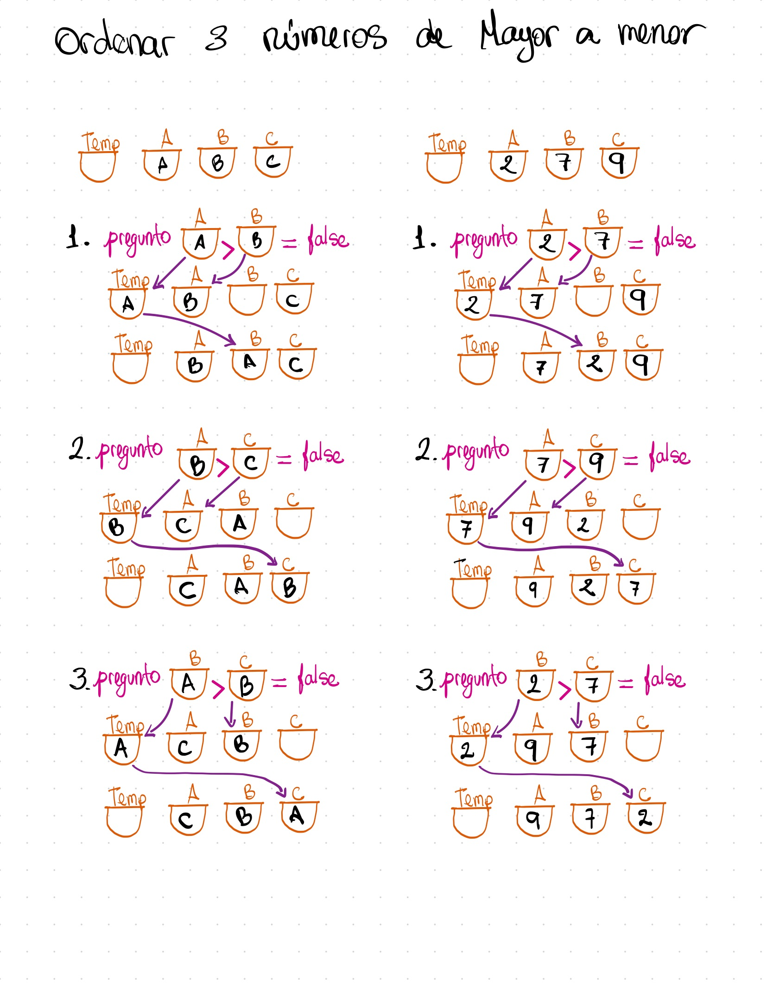

# Ordenador de 3 números

Programa en JavaScript que solicita 3 números al usuario, los analiza y los muestra ordenados de mayor a menor y de menor a mayor.

## Instrucciones

Debe solicitar al usuario 3 números por prompt y guardarlos en sus respectivas variables.

Debe analizar los números, identificar cuál es el número mayor, el número del centro y el número menor.

Debe imprimir los números por consola o por el DOM ordenados de mayor a menor, y de menor a mayor.

Debe ser capaz de identificar si los números son iguales e imprimir un mensaje por consola o por el DOM diciendo que los números son iguales.

## Cómo ejecutarlo

```bash
node main.js
```

El programa pedirá los tres números uno a uno en la consola.

## Casos de prueba

| Entrada   | Salida (mayor a menor) | Salida (menor a mayor) |
| --------- | ---------------------- | ---------------------- |
| `4, 4, 2` | `4, 4, 2`              | `2, 4, 4`              |
| `4, 2, 4` | `4, 4, 2`              | `2, 4, 4`              |
| `2, 4, 4` | `4, 4, 2`              | `2, 4, 4`              |

## Cómo lo resolví - el algoritmo en un dibujo



### Uso de la variable temp para intercambiar datos

Se declara la variable temp como un contenedor extra para permitir el intercambio del contenido de las variables. Al intentar intercambiar dos números almacenados en variables, no se puede hacer directamente a = b; b = a; porque el valor original de a se sobrescribiría en la primera instrucción.

Por ejemplo, si a = 2 y b = 7: al ejecutar a = b, la variable a pasa a valer 7, pero el valor original (2) se pierde para siempre, haciendo que la siguiente línea (b = a) solo vuelva a asignar 7 a b, resultando en a = 7 y b = 7.

Para evitar esto, se crea el contenedor temporal (temp), que guarda el valor inicial de a (el 2) de forma provisional mientras dura el movimiento, permitiendo completar el intercambio de manera correcta.

Para ilustrarlo, supongamos que tengo un tazón Amarillo (a) y un tazón Blanco (b). Debo tener en el tazón Amarillo (a), arroz con leche y en el Blanco (b) mazamorra, pero están intercambiados, en el Amarillo actualmente está la mazamorra y en el Blanco el arroz con leche.

-- insertar aqui imagen 1.

 No puedo servir directamente el contenido del tazón Blanco dentro del tazón Amarillo, porque la mazamorra terminaría cayendo encima del arroz con leche, arruinando los postres originales.

Para resolver este problema sin mezclar ni perder ninguno de los postres busco en mi despensa mi tazón Temporal.

Entonces ahi ya puedo mover el arroz con leche a mi tazón Temporal, vaciando por completo el tazón Balnco. Y ahora que el tazón Blanco quedó libre, puedo pasar tranquilamente la mazamorra desde el tazón Amarillo hacia su recipiente correcto, el tazón Blanco. Finalmente, tomo el arroz con leche que serví provisionalmente en el tazón Temporal y lo paso al tazón Amarillo que acaba de desocuparse. Gracias a ese tazón auxiliar que me sirvió de puente, logré intercambiar los postres entre sus recipientes originales sin inconvenientes.

### Casteo con `Number()`

`readline` siempre entrega texto, se usa Number par castear los valores recibidos por consola como tipo numerico.

## Requisitos

- Node.js instalado en el sistema.
